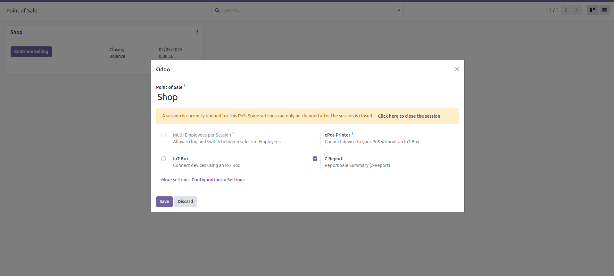
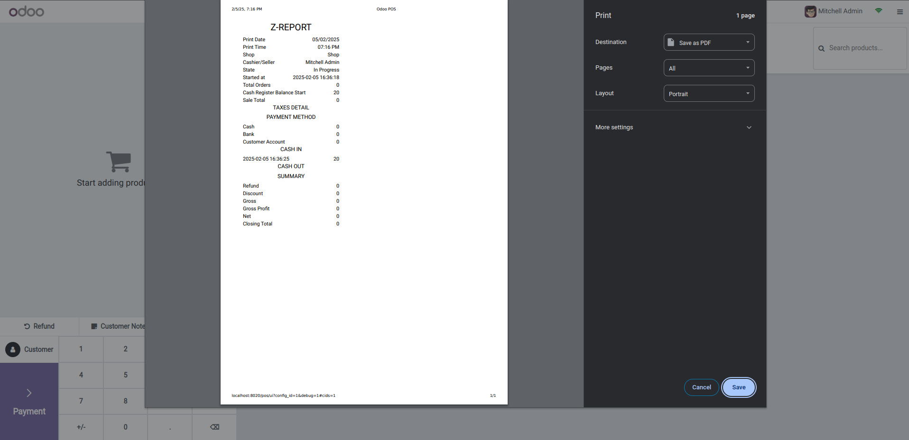

# 🔒 Detalle del Día TPV con Protección por Contraseña

[](https://www.odoo.com)
[](https://www.odoo.com/documentation/18.0/legal/licenses.html)
[](https://renace.tech)

Módulo para generar reportes detallados del día en el Punto de Venta de Odoo 18 con **protección por contraseña avanzada**.

## ✨ Características Principales

- **🔐 Protección por Contraseña**: Acceso restringido a los reportes mediante contraseña configurable
- **👁️ Contraseña Oculta**: La contraseña se oculta mientras se escribe (asteriscos)
- **📊 Reporte-Z Completo**: Genera un resumen detallado de las ventas del día
- **⚙️ Configuración Flexible**: Contraseña opcional por punto de venta
- **🎨 Interfaz Profesional**: Modal elegante integrado en el POS
- **⌨️ Atajos de Teclado**: Enter para confirmar, Escape para cancelar

## 🚀 Instalación

1. **Descargar el módulo**:
   ```bash
   git clone https://github.com/ExpertosTI/pos_rnc_report.git
   ```

2. **Copiar a addons**:
   ```bash
   cp -r pos_rnc_report /path/to/odoo/addons/
   ```

3. **Actualizar lista de aplicaciones** en Odoo

4. **Instalar** el módulo desde Aplicaciones

## ⚙️ Configuración

### Paso 1: Activar el Reporte
1. Ir a **Punto de Venta > Configuración > Puntos de Venta**
2. Seleccionar el punto de venta deseado
3. Activar **"Resumen de Ventas (Reporte-Z)"**

### Paso 2: Configurar Contraseña (Opcional)
1. En la misma configuración del POS
2. Establecer una **"Contraseña del Reporte"**
3. Guardar cambios

## 📱 Uso

### Sin Contraseña Configurada
- El botón **"Z Report"** genera el reporte directamente

### Con Contraseña Configurada
1. Hacer clic en **"Z Report"**
2. Aparece modal de contraseña con input oculto
3. Ingresar la contraseña (se muestra como asteriscos ••••••)
4. Presionar **Enter** o hacer clic en **"Confirmar"**
5. Si la contraseña es correcta, se genera el reporte

## 🔧 Características Técnicas

### Frontend
- **Modal Nativo**: HTML/CSS puro sin dependencias complejas
- **Contraseña Segura**: Input tipo `password` que oculta caracteres
- **Interfaz Responsiva**: Diseño adaptable a diferentes pantallas
- **Manejo de Eventos**: Soporte completo para teclado y mouse

### Backend
- **Validación Segura**: La contraseña se valida en el servidor
- **Modelo Extendido**: Campo `report_password` en `pos.config`
- **Método de Validación**: `validate_report_password()` en `pos.session`
- **Configuración UI**: Campo enviado al frontend automáticamente

### Seguridad
- **Validación Backend**: La contraseña nunca se valida solo en frontend
- **Acceso Controlado**: Solo usuarios con permisos POS pueden configurar
- **Manejo de Errores**: Mensajes informativos sin exponer información sensible

## 📁 Estructura del Módulo

```
pos_rnc_report/
├── __manifest__.py              # Configuración del módulo
├── models/
│   ├── pos_config.py           # Campo de contraseña
│   └── pos_session.py          # Validación y reporte
├── static/src/
│   ├── js/
│   │   ├── ControlButtons.js   # Lógica del botón y modal
│   │   └── PosStore.js         # Funcionalidad del reporte
│   └── xml/
│       ├── control_buttons.xml # Template del botón
│       └── ReportSalesSummary.xml # Template del reporte
├── views/
│   └── pos_config.xml          # Vista de configuración
├── wizard/                     # Wizard para backend
├── security/                   # Reglas de acceso
└── README.md                   # Esta documentación
```

## 🎯 Casos de Uso

### Restaurantes
- Proteger reportes de ventas diarias
- Control de acceso para gerentes
- Auditoría de cierres de caja

### Retail
- Seguridad en reportes financieros
- Control de inventario
- Supervisión de ventas

### Farmacias
- Reportes controlados por farmacéutico
- Cumplimiento regulatorio
- Control de medicamentos

## 🔍 Capturas de Pantalla

### Configuración POS


### Modal de Contraseña
- Input con contraseña oculta (••••••)
- Botones Confirmar/Cancelar
- Diseño profesional integrado

### Reporte Z


## 🛠️ Desarrollo

### Requisitos
- Odoo 18.0
- Python 3.8+
- Navegador moderno con soporte ES6+

### Personalización
El módulo está diseñado para ser fácilmente personalizable:

```javascript
// Personalizar el modal de contraseña
showPasswordModal() {
    // Modificar estilos, textos, comportamiento
}
```

```python
# Personalizar validación
def validate_report_password(self, password):
    # Agregar lógica adicional de validación
```

## 📞 Soporte

- **Autor**: Adderly Marte
- **Empresa**: [Renace.tech](https://renace.tech)
- **Email**: adderly@renace.tech
- **GitHub**: [ExpertosTI](https://github.com/ExpertosTI)

## 📄 Licencia

Este módulo está licenciado bajo **OPL-1** (Odoo Proprietary License v1.0).

## 🤝 Contribuciones

Las contribuciones son bienvenidas. Por favor:

1. Fork el repositorio
2. Crear una rama para tu feature (`git checkout -b feature/AmazingFeature`)
3. Commit tus cambios (`git commit -m 'Add some AmazingFeature'`)
4. Push a la rama (`git push origin feature/AmazingFeature`)
5. Abrir un Pull Request

## 📈 Changelog

### v1.0.0 (2025-09-29)
- ✅ Implementación inicial
- ✅ Protección por contraseña con input oculto
- ✅ Modal profesional nativo
- ✅ Validación backend segura
- ✅ Configuración flexible
- ✅ Documentación completa
- ✅ Compatibilidad Odoo 18

---

**Desarrollado con ❤️ por [Renace.tech](https://renace.tech)**
